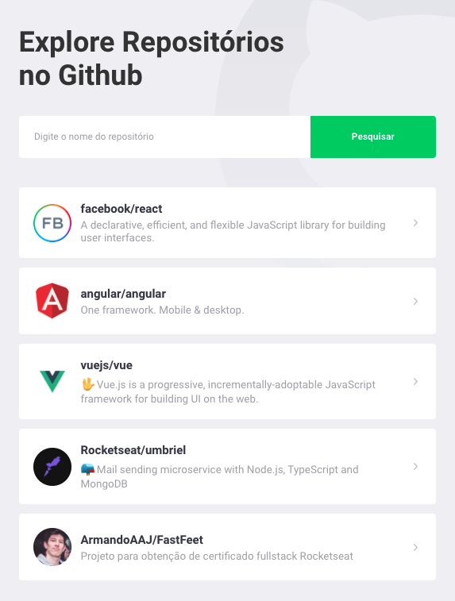
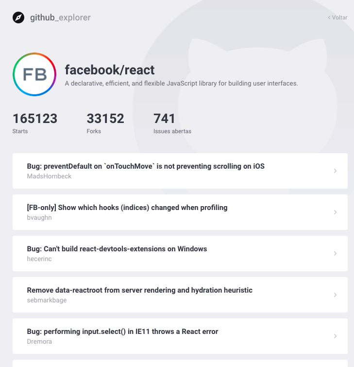

<div>


</div>

## Project
Github Explorer
Primeiro projeto ReactJS e Typescript - Bootcamp Rocketseat. 

## Quick Start

```bash
yarn
#or
npm install
```

## Run

```bash
yarn start
#or
npm run start
```

## Credits

@RocketSeat
@diego3g
